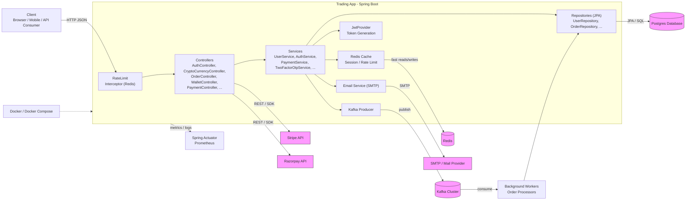

# All about this service

A Spring Boot-based cryptocurrency trading application that provides APIs for user authentication, asset management, wallet operations, and order handling. Features JWT-based security, Postgres database integration, and Docker support.

## How to run the service

### Prerequisites
- Maven (via mvnw)
- Docker & Docker Compose
- Postgres database

### Build and Run

```bash
# Build the application
cd "D:\download files\projects\trading_app"
.\mvnw.cmd clean package -DskipTests

# Start services with Docker Compose
docker-compose up --build
```

Your API will be available at: `http://localhost:8080`

### Environment Configuration
- **Server Port**: 8080
- **Database**: Postgres at `jdbc:postgresql://postgres-db:5432/trading_app`
- **Default Credentials**: `root` / `user123`
- **Authentication**: JWT Token-based


